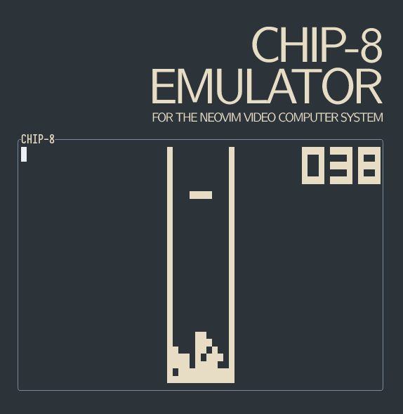

<div align="center">

</div>

# CHIP-8

A [CHIP-8](https://en.wikipedia.org/wiki/CHIP-8) emulator for the Neovim Video Computer System.

## Usage

Open a Telescope ROM picker for given directory:

```
:CHIP8Open <rom-dir>
```

Open a Telescope ROM picker with customised options:

```
:lua require("chip8")["open-picker"]("chip-8/games/dir", {keys="1234qwfparstzxcd"})
```

Supported options:

- `keys`: contiguous string describing the CHIP-8 key pad, each set of 4
        characters is one row. Defaults to `1234qwerasdfzxcv`.
- `mhz`: Mhz of the machine, defaults to 0.5 (500hz).
- `compatibility`: `CHIP-8`, `SUPER-CHIP-1.0`, `XO-CHIP`, defaults to `CHIP-8`

## Compatibility

The emulator should be CHIP-8 compatible, SUPER-CHIP and XO-CHIP compatibility
is incomplete as the emulator does not support video planes or scrolling but
passes other tests from the
[Timendus/chip8-test-suite](https://github.com/Timendus/chip8-test-suite).

CHIP-8 games can be wonky and are not always clear which versions they expect
to run under, or can just be outright broken.
